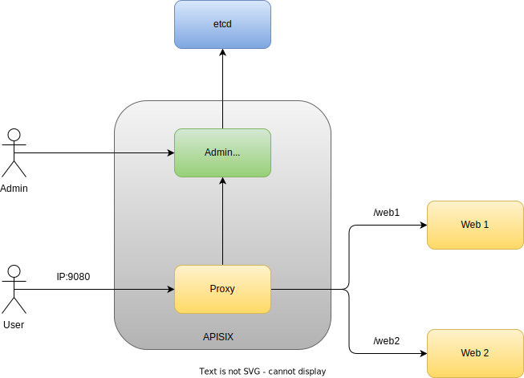

APISIX Traditional Proxy example
----------------------------------------




## Prerequisites

* Docker
* Docker compose

## Bringup

```
docker compose up -d
```

To validate

web1 upstream - http://localhost:9080/web1/

web2 upstream - http://localhost:9080/web2/

## Refer

https://github.com/apache/apisix-docker/blob/master/example/docker-compose.yml

https://apisix.apache.org/docs/docker/example/
